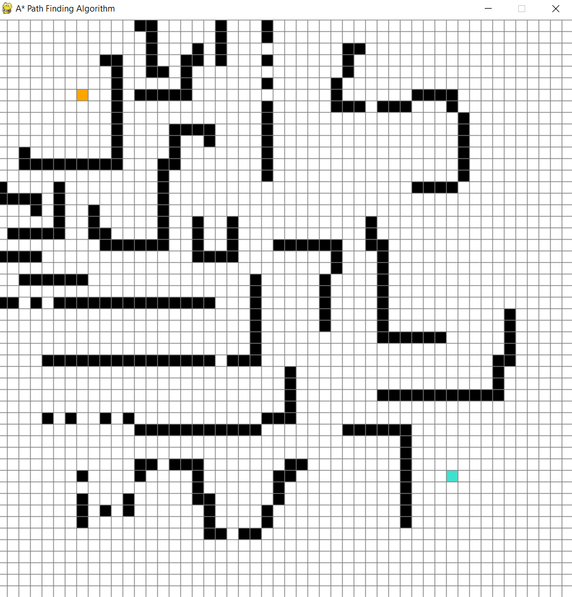
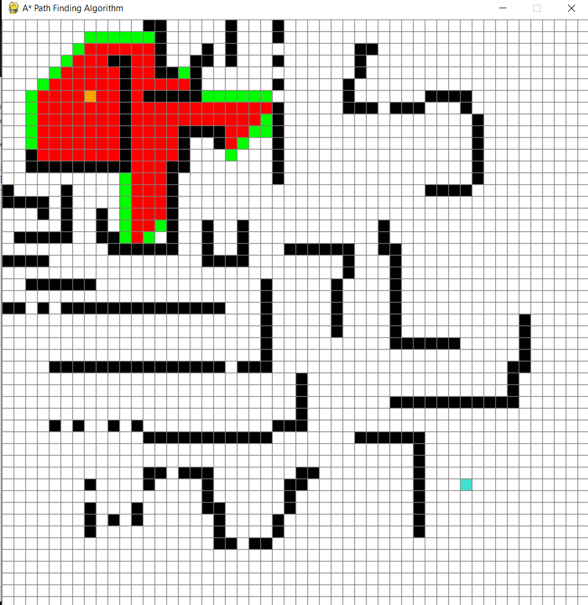
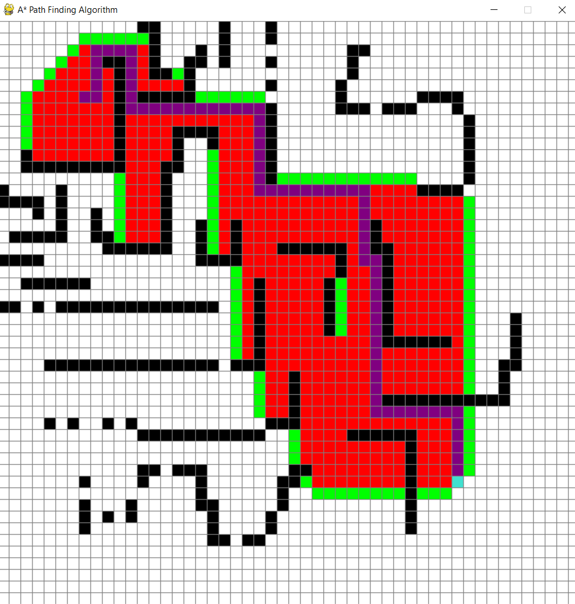

# A-Star-Path-Finding-Algorithm

A* or A Star Search algorithm is one of the best and popular technique used in path-finding and graph traversals.

## How to use:
Firstly, using your mouse cursor add the starting point. (orange point) 
Now add the target point. (cyan point) 
Now add the blocks/walls. (black blocks) 
It might look like this:  

Now hit the space bar to see the Algorithm in action 

Once the target point is found the purple route is the shortest path possible. 

If you are planning to download the code and use it, make sure you have pygame installed... 
If not, use this command: pip install pygame 
https://www.geeksforgeeks.org/how-to-install-pygame-in-windows/
